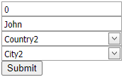

# ComboBox Extension for MVC - How to Implement Cascading Combo Boxes

<!-- run online -->
**[[Run Online]](https://codecentral.devexpress.com/e2844/)**
<!-- run online end -->

This example demonstrates how to use the MVC ComboBox extension to implement cascading combo boxes.



## Setup Combo Boxes and Their Items

Setup the primary [CountryPartial.cshtml](./CS/DevExpressMvc3CascadingCombo/Views/Home/CountryPartial.cshtml) and the secondary [CityPartial.cshtml](./CS/DevExpressMvc3CascadingCombo/Views/Home/CityPartial.cshtml) combo boxes as partial views. Specify their [CallbackRouteValues](https://docs.devexpress.com/AspNetMvc/DevExpress.Web.Mvc.AutoCompleteBoxBaseSettings.CallbackRouteValues) properties. Call the [BindList](https://docs.devexpress.com/AspNetMvc/DevExpress.Web.Mvc.ComboBoxExtension.BindList(System.Object)) method to bind the data obtained from the controller to the combo boxes.

```c#
// Index.cshtml
@Html.Partial("CountryPartial", Model)
@Html.Partial("CityPartial", Model)

// CountryPartial.cshtml
@Html.DevExpress().ComboBox(settings => {
    ...
    settings.CallbackRouteValues = new { Controller = "Home", Action = "CountryPartial" };
    settings.Properties.ValueType = typeof(int);
    settings.Properties.TextField = "Name";
    settings.Properties.ValueField = "ID";
    ...
}).BindList(CS.Models.Country.GetCountries()).Bind(Model.Country).GetHtml()

// CityPartial.cshtml
@Html.DevExpress().ComboBox(settings => {
    ...
    settings.CallbackRouteValues = new { Controller = "Home", Action = "CityPartial" };
    settings.Properties.ValueType = typeof(int);
    settings.Properties.TextField = "Name";
    settings.Properties.ValueField = "ID";
    ...
}).BindList(CS.Models.City.GetCities(Model.Country)).Bind(Model.City).GetHtml()
```

## Respond to a Selection Change and Initiate a Callback

Handle the primary combo box's client-side [SelectedIndexChanged](https://docs.devexpress.com/AspNet/js-ASPxClientComboBox.SelectedIndexChanged) event. In the event handler, call the client-side [PerformCallback](https://docs.devexpress.com/AspNetMvc/js-MVCxClientComboBox.PerformCallback(data)) method of the secondary combo box. Use the [ComboBoxProperties.Name](https://docs.devexpress.com/AspNet/js-ASPxClientControlBase.name) property value to access the combo box.

```c#
// CountryPartial.cshtml
@Html.DevExpress().ComboBox(settings => {
    settings.Name = "Country";
    ...
    settings.Properties.ClientSideEvents.SelectedIndexChanged = "function(s, e) { City.PerformCallback(); }";
    ...

// CityPartial.cshtml
@Html.DevExpress().ComboBox(settings => {
    settings.Name = "City";
    ...
```

## Filter Data Source Items

Handle the secondary combo box's client-side [BeginCallback](https://docs.devexpress.com/AspNetMvc/js-MVCxClientComboBox.BeginCallback) event. In the handler, pass the selected value of the primary combo box as a custom callback parameter. Handle the secondary combo box's [CallbackRouteValues.Action](https://docs.devexpress.com/AspNetMvc/DevExpress.Web.Mvc.AutoCompleteBoxBaseSettings.CallbackRouteValues) method to populate the combo box values based on the passed primary combo box's value.

```c#
// CityPartial.cshtml
@Html.DevExpress().ComboBox(settings => {
    ...
    settings.Properties.ClientSideEvents.BeginCallback = "function(s, e) { e.customArgs['Country'] = Country.GetValue(); }";
    ...

// HomeController.cs
public ActionResult CityPartial() {
    int country = (Request.Params["Country"] != null) ? int.Parse(Request.Params["Country"]) : -1;
    return PartialView(new Customer { Country = country });
}
```

## Documentation

- [MVC ComboBox Extension - How to implement cascaded combo boxes](https://supportcenter.devexpress.com/ticket/details/ka18675/mvc-combobox-extension-how-to-implement-cascaded-combo-boxes)
- [Passing Values to a Controller Action through Callbacks](https://docs.devexpress.com/AspNetMvc/9941/common-features/callback-based-functionality/passing-values-to-a-controller-action-through-callbacks)
- [CallbackRouteValues](https://docs.devexpress.com/AspNetMvc/DevExpress.Web.Mvc.AutoCompleteBoxBaseSettings.CallbackRouteValues)
- [BindList](https://docs.devexpress.com/AspNetMvc/DevExpress.Web.Mvc.ComboBoxExtension.BindList(System.Object))
- [SelectedIndexChanged](https://docs.devexpress.com/AspNet/js-ASPxClientComboBox.SelectedIndexChanged)
- [PerformCallback](https://docs.devexpress.com/AspNetMvc/js-MVCxClientComboBox.PerformCallback(data))
- [BeginCallback](https://docs.devexpress.com/AspNetMvc/js-MVCxClientComboBox.BeginCallback)

## Files to Look At

* [HomeController.cs](./CS/DevExpressMvc3CascadingCombo/Controllers/HomeController.cs)
* [CityPartial.cshtml](./CS/DevExpressMvc3CascadingCombo/Views/Home/CityPartial.cshtml)
* [CountryPartial.cshtml](./CS/DevExpressMvc3CascadingCombo/Views/Home/CountryPartial.cshtml)
* [Index.cshtml](./CS/DevExpressMvc3CascadingCombo/Views/Home/Index.cshtml)

## More Examples

- [GridView - How to implement cascaded combo boxes in the EditForm](https://github.com/DevExpress-Examples/gridview-how-to-implement-cascaded-combo-boxes-in-the-editform-e4425)
